<!-- Orbit 3D hero — looping render, tech stack orbiting the core in 3D -->

  

  

<h1 align="center">Yashas M</h1>

<i>Full-stack developer building AI-powered applications · Bengaluru, India</i>

  
  
  

 

- 👨🏽‍💻 Currently working on **AI-powered applications**
- 🌱 Currently learning **Full-Stack Development & AI/ML**
- 👯 Looking to collaborate on **open-source projects**
- 💬 Ask me about anything — always happy to help
- ⚡ Fun fact: I love building things that make a difference

## Stack

  

## Live stats

  
  

  

  

## Contribution snake

  

## Trophies

  

⭐️ From <a href="https://github.com/Yashasm18">Yashas</a>

